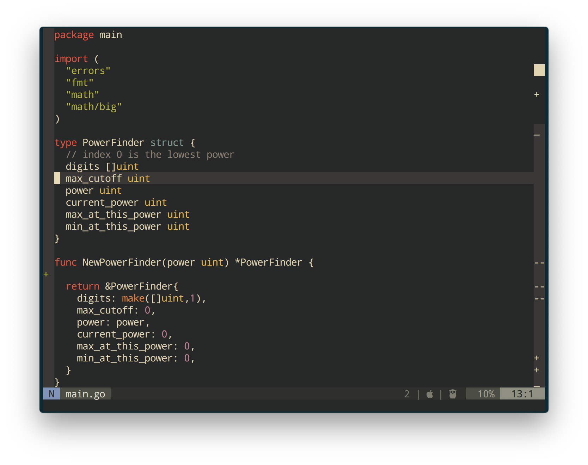

# nvim-sluice

A signs gutter for the right side of the window.

## Install

```vim
Plug 'dsummersl/nvim-sluice'
```

## Screenshot




## Commands

`SluiceEnable` and `SluiceDisable`.

## Development

Run tests:

    lua tests/suite.lua
