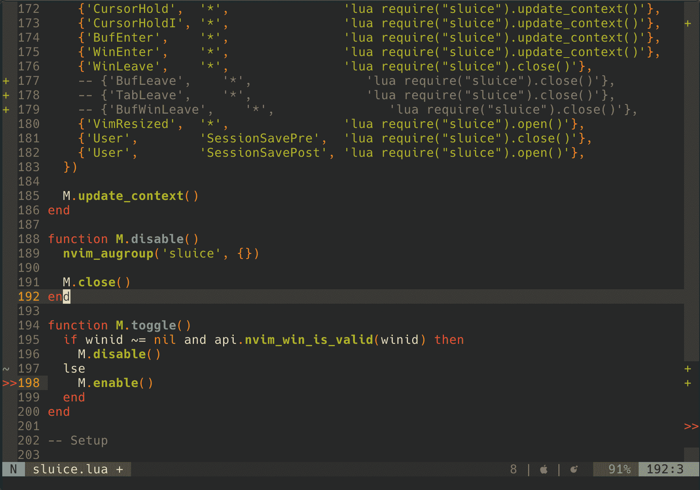

# nvim-sluice

A neovim minimap of the +signs gutter for the right side of the window.

## Install

```vim
Plug 'dsummersl/nvim-sluice'
```

## Screenshot

[](https://asciinema.org/a/QXQfhGBm5Zlx1R2oYQkgQfYVu?t=10)

See this [asciinema screencast](https://asciinema.org/a/QXQfhGBm5Zlx1R2oYQkgQfYVu?t=10) for a demonstration.

## Commands

`SluiceEnable`/`SluiceDisable`/`SluiceToggle`.

## Development

Install dependencies:

    luarocks --lua-version 5.1 install busted
    luarocks --lua-version 5.1 install luacheck

Run tests:

    make lint
    make test

## Notes

Thanks to [nvim-treesitter-context](https://github.com/romgrk/nvim-treesitter-context) which I based the lua windowing that this plugin uses.

The idea behind this project is based on [vim-sluice](https://github.com/dsummersl/vim-sluice) -- a buggier and more feature-ful version of this plugin for vim/gvim.

## TODO

- Show specific highlights visible in the screen (matchup in particular)
